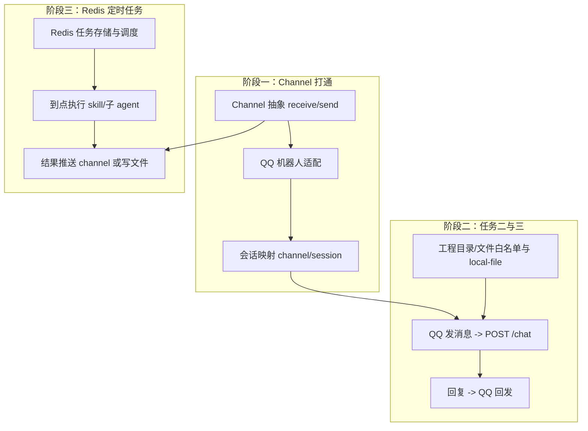

# Claw 目标缺口梳理（细化版）

基于你补充的语义，将三个目标拆成可落地的工程需求与实现建议。

---

## 任务一：Redis 定时任务 + Skill/子 Agent 执行 + 结果推送或落盘

**本质**：Claw 能**创建基于 Redis 的定时任务**，到点后按任务描述调用对应 **skill** 或 **子 agent** 执行，最后根据用户配置把结果**推送（如发到某 channel）或保存到文件**。

- **定时存储**：用 **Redis** 存任务定义与触发时间（当前 [scheduled-tasks.ts](gateway/src/scheduled-tasks.ts) 是 JSON 文件 + 内存，需改为或增加 Redis 方案）。
- **调度到点**：到时间后根据任务描述（如「执行 weather skill + 建议 skill」）驱动现有 **skill 协议**（SKILL:/FETCH_URL: 等）或 **DELEGATE 子 agent** 执行。
- **结果出口**：执行完成后按用户配置二选一或都支持：
  - **推送到 channel**（见下文的 channel 抽象）；
  - **保存到文件**（指定路径，如 workspace 下某文件）。
- **天气/建议**：作为示例，抽象成 **skill**（如 `weather`、`suggest`），定时任务里配置「调用这些 skill」即可，不写死业务。

**当前缺口**：

- Redis 定时任务存储与调度（任务模型、到点触发、与现有 chat 流程解耦的「只执行 skill/子 agent」的轻量执行路径）。
- 任务类型/描述中能指定「用哪些 skill 或子 agent」「结果推送到哪 / 写到哪」。

---

## 任务二：通过 Channel 对话工程并返回结果

**本质**：沿用现有「skill + 子 agent」能力，区别是**入口与出口都走 channel**——用户在微信服务号/钉钉机器人/企业微信机器人里发消息，Claw 当请求处理，执行完后把结果**返回给同一 channel**。

- **入口**：Channel 收到用户消息 → 转成内部消息 → 调用现有 `POST /chat`（或等价流式接口）。
- **出口**：Agent 最终回复 → 通过同一 channel 推回用户（微信/钉钉/企微等）。
- **实现**：需要 **channel 抽象**（接收消息、发送消息），并为每种 channel 写一个适配（如 QQ 机器人、钉钉、企微等）。

**当前缺口**：

- Channel 抽象层（接收 + 发送）。
- 至少一种 channel 的实现（见下「Channel 选型」）。

---

## 任务三：在 Channel 上发号施令 + 工程目录/文件能力

**本质**：与任务二相同，通过 **channel** 发号施令；Claw 需具备**操作工程目录与文件**的能力（读文件、列目录等），在对话中按用户指令执行并返回结果到 channel。

- **能力**：已有 [local-file](gateway/src/local-file.ts)（READ_FILE / WRITE_FILE / LIST_DIR，受 `LOCAL_FILE_ROOT` 限制），可在此基础上扩展或增加「工程目录」配置（如 ai-web 路径），保证 channel 发来的「读某项目下的文件」等指令能安全执行。
- **与任务二关系**：同一套 channel 入口/出口，只是对话内容会触发「读文件/列目录」等协议，无需单独再做一套。

**当前缺口**：

- 若 ai-web 等工程不在当前 `LOCAL_FILE_ROOT` 下，需在配置中支持多目录或指定工程根路径，并保证 local-file 或新协议只在这些白名单下操作。
- （可选）Git 类 skill（提交、推送等）若你要在 channel 里「帮我提交 ai-web」再一起做。

---

## Channel 选型建议：优先 QQ 机器人

你已具备 **QQ 机器人** 的配置与参数、且不需要额外物料，建议 **首通道实现 QQ 机器人**，作为「最好实现」的方案。

- **优点**：物料现成、对接快；可先打通「QQ 发消息 → 网关处理 → 结果回 QQ」的闭环，后续再加钉钉/企微等只需复用同一套 channel 抽象与 chat 调用。
- **实现要点**：
  - 在网关侧或独立服务中增加 **channel 抽象**：`receive(message, channelId)`、`send(channelId, text)`。
  - QQ 机器人适配：用你现有的 QQ 机器人框架/API（如官方机器人、Mirai 等）在「收到消息」时调网关 `POST /chat`（可带 channel_id/session_id），拿到回复后调 QQ 发送接口把结果发回用户/群。
  - 会话：可用 `channel_id + user_id` 或 QQ 的 openid 等映射到现有 `session_id`，保证多轮对话上下文一致。

**其他 channel**（钉钉、企微、微信服务号）可在同一抽象上后续加适配，无需改核心逻辑。

---

## 实现顺序建议（与依赖关系）

1. **阶段一**：做 **Channel 抽象** + **QQ 机器人** 接入（收消息 → 调 chat → 发回 QQ），并做好 channel/会话映射。这样任务二、三的「在 channel 上操作并返回」即可复用。
2. **阶段二**：巩固任务三所需**工程目录/文件**（配置多根目录或 ai-web 路径、local-file 白名单），在 QQ 对话中能执行读文件/列目录等。
3. **阶段三**：做 **Redis 定时任务**：创建/存储任务、到点触发、按描述调用 skill 或子 agent、结果推送到 channel 或保存到文件。

---

## 小结表

| 目标 | 核心能力 | 主要缺口 |
|------|----------|----------|
| 任务一 | Redis 定时任务 → skill/子 agent → 推送或落盘 | Redis 调度、任务描述解析、与执行链路、结果出口 |
| 任务二 | Channel 对话 → 现有 skill/子 agent → 结果回 channel | Channel 抽象、QQ 机器人适配、会话映射 |
| 任务三 | Channel 发号施令 + 工程目录/文件读写 | 多目录/工程路径配置、local-file 白名单（或扩展） |

**Channel**：建议先用 **QQ 机器人** 实现，你已有配置与参数；钉钉/企微/微信服务号后续按同一抽象扩展即可。
