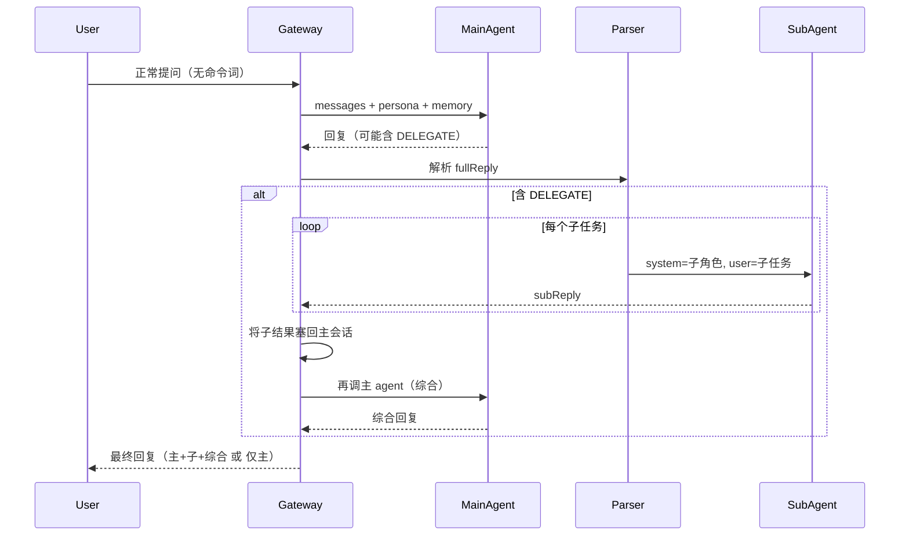

# P0：主 agent + 子 agent 协同 — 完整版计划

## 1. 目标与需求

- **主 agent 自主派发**：主 agent 在推理中自己决定何时把子任务交给子角色，在回复中输出约定格式；用户正常提问，无需命令词。
- **子 agent**：同模型、不同 system（子角色）的一次调用，执行子任务后把结果回传。
- **综合并继续**：子结果回传后，再调一次主 agent，基于「主回复 + 子结果」生成综合回复，作为最终返回给用户的内容。

---

## 2. 端到端流程

- **无 DELEGATE**：主回复即最终回复，与现有行为一致。
- **有 DELEGATE**：主回复 → 解析 → 子 agent 串行执行 → 子结果写回主会话 → 再调主 agent → 综合回复为最终回复。

---

## 3. 阶段一：约定与解析

### 3.1 派发格式

- 主 agent 在回复中使用：`DELEGATE: 子任务描述 | 子角色名`
- 可多行、多个，例如：
  - `DELEGATE: 查一下某概念的定义 | researcher`
  - `DELEGATE: 用代码实现上述逻辑 | coder`

### 3.2 解析

- 新建 `gateway/src/delegate.ts`（或 `agent.ts`）。
- 导出 `parseDelegate(reply: string): { task: string; role: string }[]`。
- 用正则提取所有 `DELEGATE: ... | ...`，返回数组；无则返回 `[]`。

### 3.3 主回复中 DELEGATE 段的处理

- 写入主会话的「主 agent 第一条回复」建议：去掉或替换 DELEGATE 行（如替换为「已派发子任务」），避免把原始标记当自然语言展示。
- 建议首版：写入会话时去掉 DELEGATE 行，只保留主 agent 的「正常叙述」部分。

---

## 4. 阶段二：子角色与子 agent

### 4.1 子角色 system 配置

- 提供「子角色名 → system 文本」映射。
- 实现方式任选其一：
  - **A**：`gateway/data/subpersona/<role>.md`，按角色名读文件。
  - **B**：单文件（如 `subpersona.json` 或 persona 中的约定块）解析为 `Map<string, string>`。
- 导出 `getSubPersona(role: string): string`，未配置角色返回空或默认说明。

### 4.2 子 agent 调用

- 在同一模块或 `ollama.ts` 中实现：
  - `runSubAgent(task: string, role: string, modelOverride?: string): Promise<string>`
- 逻辑：`system = getSubPersona(role)`，`messages = [{ role: "user", content: task }]`，不注入主 persona/memory；调用现有 `chatWithOllama`，返回子回复文本。
- 多个 DELEGATE 时：串行调用，将各子回复用约定分隔符（如 `\n\n---\n\n`）拼成一段 `subResult`。

---

## 5. 阶段三：非流式（POST /chat）完整流程

1. 追加 user 消息，`buildMessagesWithSystem(sessionMessages)`，调主 agent，得 `mainReply`。
2. `delegates = parseDelegate(mainReply)`。
3. **若无 DELEGATE**：  
   `sessionMessages.push(assistant, mainReply)` → `appendMemory` → `res.json({ reply: mainReply })`。
4. **若有 DELEGATE**：  
   - 串行执行每个 `runSubAgent(task, role, modelOverride)`，得到 `subResult`。  
   - 构造「回传主 agent 的上下文」：  
     - 主回复写入会话时建议去掉 DELEGATE 行得 `mainReplyClean`，  
     - `sessionMessages.push({ role: "assistant", content: mainReplyClean })`，  
     - 再 `sessionMessages.push({ role: "user", content: "[子任务结果]\n\n" + subResult })`（或约定格式）。  
   - 再次 `buildMessagesWithSystem(sessionMessages)`，调主 agent，得 `finalReply`（综合回复）。  
   - `sessionMessages.push({ role: "assistant", content: finalReply })`。  
   - `appendMemory(userMessage, finalReply)`（只写最终综合回复即可）。  
   - `res.json({ reply: finalReply })`。

---

## 6. 阶段四：流式（POST /chat/stream）完整流程

1. 主 agent 流式照常：SSE 推 `chunk`/`thinking`，累积 `fullReply`。
2. 主 agent 流式 **结束** 后：
   - `delegates = parseDelegate(fullReply)`。
   - **若无 DELEGATE**：  
     `sessionMessages.push(assistant, fullReply)` → `appendMemory` → `res.write("data: [DONE]\n\n")` → `res.end()`。
   - **若有 DELEGATE**：  
     - 先向客户端发完已有主流式（若尚未发完则补齐），然后可选发一条 `data: { chunk: "\n\n[正在执行子任务…]\n\n" }` 或静默；  
     - 串行执行子 agent，得到 `subResult`；  
     - 主回复处理同非流式：`mainReplyClean` 写入会话，再 push `user: [子任务结果]\n\n` + subResult；  
     - **再调主 agent 做综合**：  
       - **综合阶段建议用非流式**（实现简单）：`chatWithOllama(messagesForOllama)` 得 `finalReply`，然后通过 SSE 一次性追加：`data: { chunk: "\n\n" + finalReply }\n\n`（或分段发送以兼容前端），再 `data: [DONE]\n\n`。  
       - 若希望综合也流式：再调 `streamChatWithOllama`，把新产生的 chunk 继续推给前端，最后再 `[DONE]`。  
     - `sessionMessages.push(assistant, finalReply)`，`appendMemory(userMessage, finalReply)`，`res.write("data: [DONE]\n\n")`，`res.end()`。

---

## 7. 阶段五：主 agent 的 persona

- 在 `gateway/data/persona.md`（或当前主 agent system 来源）中增加：
  - 当需要将子任务交给专门角色时，在回复中使用：`DELEGATE: 子任务描述 | 子角色名`，可多行。
  - 列出当前支持的子角色名（与 `getSubPersona` 的 key 一致）及简要说明，便于主 agent 自主决定派发对象。

---

## 8. 阶段六：前端（可选增强）

- **最小**：前端不改，仍是一次请求、一次回复；最终回复 = 综合回复（可能内含对子结果的总结）。
- **增强**：若需区分展示「主回复 / 子结果 / 综合回复」，可在 SSE 中增加事件类型（如 `type: "main" | "sub_result" | "summary"`），前端按类型分块渲染；属体验优化，非 P0 必须。

---

## 9. 任务清单（完整版）

| 序号 | 任务 | 产出/说明 |
|------|------|-----------|
| 1 | 约定 DELEGATE 格式，实现 `parseDelegate(reply)` | `gateway/src/delegate.ts` |
| 2 | 子角色 system 配置与 `getSubPersona(role)` | 配置与读取逻辑 |
| 3 | 实现 `runSubAgent(task, role, model?)`，多子任务串行 | delegate 或 ollama 模块 |
| 4 | 主回复中 DELEGATE 行的清洗（写入会话用） | 工具函数或 parseDelegate 扩展 |
| 5 | POST /chat：主回复 → 解析 → 子调用 → 子结果写回主会话 → 再调主 agent → 返回综合回复 | `gateway/src/index.ts` |
| 6 | POST /chat/stream：主流式结束 → 解析 → 子调用 → 子结果写回主会话 → 再调主 agent（综合） → SSE 推送综合回复 → [DONE] | `gateway/src/index.ts` |
| 7 | persona 中增加 DELEGATE 与子角色说明 | `gateway/data/persona.md` 或 example |
| 8 | 联调与验收：能触发 DELEGATE 的提问 → 子结果 → 综合回复正确返回 | 手动或脚本 |

---

## 10. 小结

- **谁命令**：主 agent 自主在回复中写 DELEGATE，用户无需命令词。
- **完整流程**：主 agent → 解析 DELEGATE → 子 agent 执行 → 子结果回传 → 主 agent 再综合 → 最终回复。
- 非流式与流式均按上述完整流程实现。
