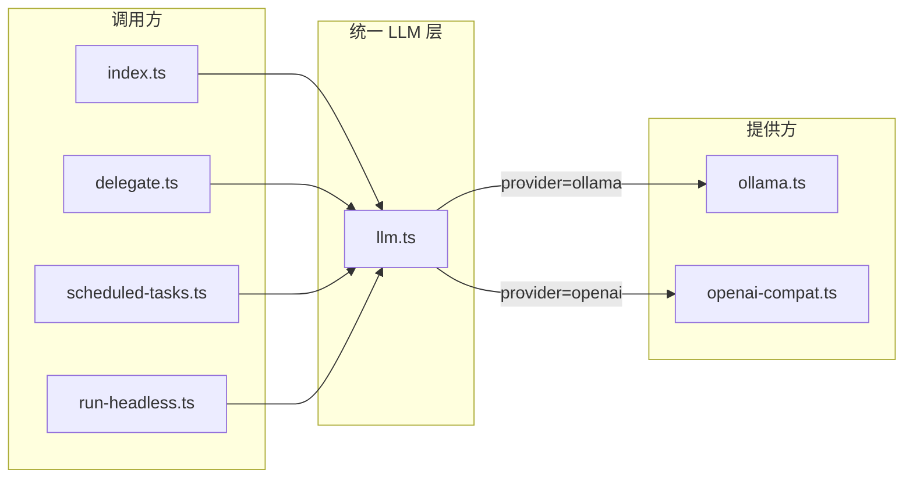

# 远程 API 支持与 Todo 更新（计划记录）

本文档为「支持远程 API 调用（如 DeepSeek）+ 前端切换 + 远程走 tool call + 双人设」的完整实现方案记录，便于后续按步骤落地与对照。

---

## 一、Todo 更新（最高优先级）

在 `docs/todo.md` 的 **「二、待办（按优先级）」** 最上方新增 **P0 小节**，置于现有「P0：核心体验与修 bug」之前，内容为：

- **P0：支持远程 API 调用（如 DeepSeek）**
  - 网关支持通过 API Key 调用远程模型（如 DeepSeek）：配置 `LLM_PROVIDER`、API Key 与模型名，非流式/流式对话均走统一 LLM 层，可切换 Ollama 与远程 API。

这样该条即为当前最高优先级待办。

---

## 二、实现方案总览

### 架构示意

### 契约与配置

- **契约**：对外统一接口为 `chat(messages, model?)` 与 `streamChat(messages, callbacks, model?)`，消息类型沿用当前 `OllamaMessage`（或抽成通用 `LLMMessage` 放在 llm 层）。
- **配置驱动**：根据 `LLM_PROVIDER`（如 `ollama` | `openai`）与对应 env（如 `OPENAI_API_KEY`、`OPENAI_BASE_URL`、`OPENAI_MODEL`）选择实现；DeepSeek 视为 OpenAI 兼容（固定 base URL 或通过 env 配置）。

### 2.1 双路径：远程 tool call vs 本地商定协议

- **远程（openai）**：走 **tool call**。请求带 `tools` 定义；模型返回 `tool_calls`，网关执行工具后把结果塞回 messages 再调模型；**不**在回复正文中解析 DELEGATE/TIME_TASK/SKILL/FETCH_URL，无需 mainReplyClean、协议行过滤等。
- **本地（ollama）**：**保留现有商定协议**。继续使用 `gateway/data/AGENTS.md` 与现有 bootstrap，从正文解析 DELEGATE/TIME_TASK/SKILL/FETCH_URL，逻辑与人设不变。

### 2.2 人设双文件与内容共用

- **AGENTS.md**（现有）：供 **Ollama** 使用，内容**保留不改**。仍为「在回复中写 DELEGATE:/TIME_TASK:/SKILL:/FETCH_URL:」的格式说明。
- **新文件 AGENTS-TOOLS.md**：供 **远程 API** 使用。内容为「身份 + 通用行为」与「何时用哪个工具」的说明；工具列表由系统在请求中注入（`tools` 数组），不依赖人设里的协议格式。与 AGENTS.md **内容共用**：身份、当前时间、综合子任务结果等通用段可复用——实现方式二选一：
  - **共用片段**：抽出一份共用内容（如新建 `AGENTS-COMMON.md` 或复用 SOUL/现有段落），bootstrap 按 provider 拼接「共用 + AGENTS.md」或「共用 + AGENTS-TOOLS.md」。
  - **两文件各自保留相同开头**：AGENTS-TOOLS.md 开头与 AGENTS.md 的「你是小克…」等一致，仅后半部分为「使用以下工具…」；共用通过复制或后续再抽共用片段。
- **配置**：在 `gateway/src/config.ts` 中增加 `agentsPathTools`（或约定与 `agentsPath` 同目录、文件名为 `AGENTS-TOOLS.md`）。`gateway/src/bootstrap.ts` 中按 provider 选择 `readAgents()` 还是 `readAgentsTools()`，其余 bootstrap 块（当前时间、技能列表、子角色列表等）可共用，仅「人设正文」来源不同。

---

## 三、具体实现步骤

### 1. 配置层（gateway/src/config.ts）

- 新增环境变量（示例命名，可与现有风格统一）：
  - `LLM_PROVIDER`：`ollama`（默认）| `openai`
  - `OPENAI_BASE_URL`：可选，默认 DeepSeek 可用 `https://api.deepseek.com`
  - `OPENAI_API_KEY`：远程 API Key（DeepSeek 即填其 API Key）
  - `OPENAI_MODEL`：远程模型名，如 `deepseek-chat`
- 在 `config` 对象中导出 `llmProvider`、`openaiBaseUrl`、`openaiApiKey`、`openaiModel`；当 `LLM_PROVIDER=openai` 时若未配置 `OPENAI_API_KEY` 可在启动时打 log 或抛错。

### 2. 统一 LLM 入口（gateway/src/llm.ts，新建）

- 定义统一类型（可与现有对齐）：
  - `LLMMessage`：`{ role: "system"|"user"|"assistant"; content: string }`（与当前 `OllamaMessage` 一致即可，可从 ollama 移出或 re-export）。
  - `StreamCallbacks`：`{ onThinking?: (text: string) => void; onChunk: (text: string) => void }`（与现有一致）。
- 导出两个函数，均支持可选 `providerOverride?: 'ollama' | 'openai'`：
  - `chat(messages, modelOverride?, providerOverride?): Promise<string>`
  - `streamChat(messages, callbacks, modelOverride?, providerOverride?): Promise<void>`
- 内部实际使用的 provider = providerOverride ?? config.llmProvider；再根据该 provider 分支：
  - `ollama`：调用现有 `chatWithOllama` / `streamChatWithOllama`（传入的 modelOverride 或默认 `config.ollamaModel`）。
  - `openai`：调用新模块 `openai-compat.ts` 的 `chatWithOpenAI` / `streamChatWithOpenAI`（使用 `config.openaiBaseUrl`、`config.openaiApiKey`、`config.openaiModel`，modelOverride 可选覆盖）。

### 3. OpenAI 兼容适配与 tool call（gateway/src/openai-compat.ts，新建）

- **基础 chat**（无 tools 时，供子 agent、定时任务等简单调用）：
  - 非流式：`POST {baseUrl}/v1/chat/completions`，Body `{ model, messages, stream: false }`；响应解析 `choices[0].message.content`。
  - 流式：同上 `stream: true`，SSE 解析 `delta.content` → `onChunk`；可选 reasoning → `onThinking`。
- **带 tools 的对话（主对话远程路径）**：
  - 请求 Body 增加 `tools`（delegate、create_scheduled_task、load_skill、fetch_url 等的 JSON Schema）、`tool_choice` 按需。
  - 响应可能含 `choices[0].message.tool_calls`；网关解析后执行对应工具，将结果以 `role: tool` 消息追加，再请求下一轮；循环直到无 tool_calls 或返回纯文本。流式时需处理 `delta.tool_calls` 的累积与执行时机。
- 可选：DeepSeek base URL 默认值 `https://api.deepseek.com`。

### 4. 调用方改为使用 llm 层

- `gateway/src/index.ts`：将 `chatWithOllama` / `streamChatWithOllama` 的 import 与所有调用改为 `llm.chat` / `llm.streamChat`；`toSingleModel` 仍基于当前默认模型逻辑，默认模型从 config 取（ollama 用 `ollamaModel`，openai 用 `openaiModel`）。
- `gateway/src/delegate.ts`：同上，改为从 `llm.ts` 引入并调用。
- `gateway/src/scheduled-tasks.ts`：同上。
- `gateway/src/run-headless.ts`：同上。
- 保留 `gateway/src/ollama.ts` 仅被 `llm.ts` 引用，不对外暴露给业务代码。

### 5. GET /config、GET /models 与请求体 provider

- **GET /config**：返回中增加 `llmProvider: 'ollama' | 'openai'`（当前网关默认），以及 `ollamaModel`/`openaiModel`、defaultModel、可选模型列表；不暴露 API Key。前端用 `llmProvider` 初始化「当前使用方」并展示切换按钮。
- **GET /models**：当 provider 为 ollama 时逻辑不变（config.ollamaModels 或 Ollama `/api/tags`）；当 provider 为 openai 时返回配置的模型列表（如 `[config.openaiModel]`），避免再调 Ollama。
- **POST /chat 与 POST /chat/stream**：请求体支持可选 `provider?: 'ollama' | 'openai'`。若存在且合法，当次请求使用该 provider；否则使用 `config.llmProvider`。网关在 `gateway/src/index.ts` 中从 body 取 provider，传给 llm 层（llm 层需支持 provider 覆盖）。
- **llm 层**：`chat` / `streamChat` 增加可选参数 `providerOverride?: 'ollama' | 'openai'`；优先使用 providerOverride，否则用 config.llmProvider。index 从 body.provider 传入该参数。

### 6. 人设双文件与 bootstrap 按 provider 分支

- **配置**：`gateway/src/config.ts` 增加 `agentsPathTools`（如与 `agentsPath` 同目录则 `AGENTS-TOOLS.md`，或独立路径），与现有 `agentsPath`（Ollama 用 AGENTS.md）并存。
- **Bootstrap**：`gateway/src/bootstrap.ts` 中：
  - 新增 `readAgentsTools()`，读取 `agentsPathTools` 对应文件；现有 `readAgents()` 仍读 `agentsPath`。
  - `loadBootstrap`（及流式所用构建 system 的逻辑）增加参数或根据「当前请求 provider」选择：provider 为 ollama 时用 `readAgents()`，为 openai 时用 `readAgentsTools()`；其余块（当前时间、技能列表、子角色列表等）共用。若采用「共用片段」，可再拆出 `readAgentsCommon()` 与两段人设拼接。
- **新建 AGENTS-TOOLS.md**：放在 workspace 或 gateway/data，内容为身份与通用行为（与 AGENTS 共用部分）+ 远程专用「使用以下工具…」说明；不写 DELEGATE/TIME_TASK 等行格式，改为「需要派发时调用 delegate 工具」等描述。工具名与参数与 openai-compat 中定义的 `tools` 一致。

### 7. 主对话流按 provider 分流（index.ts）

- **Ollama**：维持现有流程——build system（含 readAgents）、调用 llm.streamChat/chat、解析回复正文中的 DELEGATE/TIME_TASK/SKILL/FETCH_URL，执行后注入再调或返回；mainReplyClean、子 agent 等逻辑不变。
- **OpenAI（远程）**：build system 用 readAgentsTools + 共用块；请求带 `tools`；调用 openai-compat 的「带 tool 的流式/非流式」接口；若返回 tool_calls 则执行（delegate → 子 agent、create_scheduled_task → 定时任务、load_skill、fetch_url）并追加 tool result，再请求下一轮；**不**对回复正文做协议行解析。前端事件（chunk、sub_thinking、summary 等）由网关在工具执行与多轮请求中组包发送，保持与现有流式协议兼容。

### 8. 文档与 .env 示例

- `.env.example`：增加 `LLM_PROVIDER`、`OPENAI_BASE_URL`、`OPENAI_API_KEY`、`OPENAI_MODEL` 的注释说明（DeepSeek 示例：仅填 API Key 与模型名即可）。
- `gateway/README.md`：在「配置」小节补充远程 API 使用说明；说明人设双文件：AGENTS.md（Ollama/协议）、AGENTS-TOOLS.md（远程/tool call），内容可共用。

---

## 四、前端：页面按钮切换 LLM / Ollama

### 4.1 接口约定

- `frontend/src/config/env.ts`：`GatewayConfig` 增加 `llmProvider?: 'ollama' | 'openai'`；`getGatewayConfig()` 解析 GET /config 返回的 `llmProvider`。
- `frontend/src/types/chat.ts`：`ChatRequest` 增加可选 `provider?: 'ollama' | 'openai'`。流式请求 body 同样在 `frontend/src/api/gateway.ts` 中附带 `provider`。

### 4.2 状态与请求传递

- `frontend/src/components/ChatConsole.tsx`：
  - 新增 state：`selectedProvider: 'ollama' | 'openai'`，初始值来自 `getGatewayConfig().llmProvider`（缺省为 `'ollama'`）；可选使用 `localStorage` 持久化，键如 `claw_llm_provider`。
  - 将 `selectedProvider` 与 `onProviderChange` 传给 `MessageInput`（或仅在 ChatConsole 内放切换控件，并把 selectedProvider 传给 useChat）。
- `frontend/src/hooks/useChat.ts`：`UseChatOptions` 增加 `selectedProvider?: 'ollama' | 'openai'`；调用 `sendMessageStreaming(..., selectedModel, sessionId)` 时改为同时传入 `selectedProvider`。
- `frontend/src/api/gateway.ts`：
  - `sendMessage`、`sendMessageStreaming` 增加参数 `provider?: 'ollama' | 'openai'`。
  - 请求 body 中在已有 `message`、`model`、`sessionId` 基础上，当 `provider` 有值时附带 `provider`。非流式同理。

### 4.3 UI 位置与样式

- 在输入区附近增加**提供方切换**：两个选项「Ollama」与「远程 API」（或「OpenAI 兼容」），与现有模型下拉并列或在其左侧。
- 实现方式二选一即可：
  - **方案 A**：在 `frontend/src/components/MessageInput.tsx` 的 props 中增加 `selectedProvider`、`onProviderChange`，在输入框同一行（模型 select 左侧）增加分段按钮或两个 button。
  - **方案 B**：在 `frontend/src/components/ChatConsole.tsx` 中，在「输入区」上方或同一行单独放一段切换（不塞进 MessageInput），再把 `selectedProvider` 传入 useChat 与 gateway。
- 若网关仅配置了单一 provider（例如只配了 Ollama），可仍展示两个选项，由后端在未配置的 provider 请求时返回明确错误；或前端根据 GET /config 的 `llmProvider` 与可选字段（如仅当 `ollamaModel` 与 openai 相关配置同时存在时）显示切换，否则只读展示当前 provider。

---

## 五、验收与注意事项

- **契约**：POST /chat、POST /chat/stream 增加可选 `provider`；GET /config 增加 `llmProvider`；前端增加切换控件并随请求发送 `provider`。
- **安全**：API Key 仅从环境变量读取，不写入代码库、不通过 API 返回。
- **兼容**：默认 `LLM_PROVIDER=ollama` 时行为与当前完全一致；**AGENTS.md 与本地商定协议保留不改**；远程路径使用 AGENTS-TOOLS.md 与 tool call，两套人设内容共用、协议/工具部分分离。
- **验证**：Ollama 路径与现有一致；切换为「远程 API」后，主对话走 tool call、无正文协议解析，子任务/定时任务/技能/抓 URL 通过工具调用完成；前端事件与展示正常。

---

## 六、小结

| 项目 | 内容 |
|------|------|
| Todo | 在 docs/todo.md 最前新增 P0「支持远程 API 调用（如 DeepSeek）」 |
| 双路径 | 远程 = tool call（不解析正文协议）；Ollama = 保留现有商定协议与 AGENTS.md |
| 人设双文件 | AGENTS.md 保留给 Ollama；新建 AGENTS-TOOLS.md 给远程，内容共用（身份/通用行为），仅协议 vs 工具说明不同；config 增加 agentsPathTools，bootstrap 按 provider 选人设来源 |
| 后端 | 配置 → llm.ts 统一入口（含 providerOverride）→ openai-compat.ts（含 tools + tool_calls 执行循环）→ 主对话 index 按 provider 分流（Ollama 现流程 / 远程 tool 流程）→ GET /config、POST /chat、GET /models、文档更新 |
| 前端 | GatewayConfig 与 ChatRequest 增加 provider → ChatConsole selectedProvider → 提供方切换按钮 → useChat/gateway 传 provider |

按上述步骤即可完成「远程 API + tool call + 双人设、Ollama 保留现有人设与协议」的完整方案。
