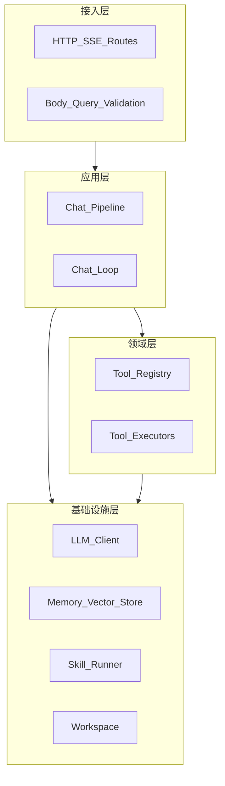

# Claw V2 设计文档

Claw 重写版的产品设计与决策汇总，面向发版与商业化，便于后续实现与迭代时查阅。本文档整理自对话中的结论与建议，不新增未讨论过的设计。

---

## 1. 概述

**文档用途**：Claw 重写版（非公司企业版）的产品设计：架构分层、重写方向、功能范围、技能机制、安全与监控。目标为可发版、具备商业化价值、市场认可的产品。

**目标**：

- 功能完整、可直接交付使用，具备商业化与市场认可度
- 架构清晰（分层、契约、依赖方向），可维护、可扩展，便于迭代与协作
- 支持市面上的 skill（含带脚本的 skill）
- 多机部署、拷贝即用，在安全环境启动即可运行，不依赖第三方执行服务或公网技能商店

**与公司方案的关系**：公司企业版 Claw（OpenSkills、WASM + 沙箱化 Shell 等）已存在；本设计面向可独立发版、具备市场认可度的产品形态，技术选型与实现按产品需求做完整方案，与公司版在部署形态与治理强度上区分。

---

## 2. 当前架构与能力（现状）

**整体**：网关(3000) + 前端(5173) + 工作区；后端通过 Ollama 调用本地/远程模型；行为由「协议行」驱动。

**主/子 agent**：

- 主 agent 回复中解析 `DELEGATE: 任务 | 角色 | 0,1`（第三段可选，表示依赖）
- 按 deps 建 DAG，层内并行、层间串行；下游执行前注入上游结果
- 执行完后主 agent 再被调一次做综合回复；综合阶段禁止再派发

**协议**：从 assistant 正文解析并执行

- DELEGATE、SKILL、FETCH_URL、BROWSER_NAVIGATE、READ_FILE/WRITE_FILE/LIST_DIR、TIME_TASK

**记忆**：单文件追加；`loadMemory()` 取最近 N 段、截断总长后拼进 system，每次请求都带

**技能**：`workspace/skills/<name>/SKILL.md` 为文档（frontmatter + 正文）；执行依赖网关内置逻辑（如 FETCH_URL 对应 fetch-url.ts），无脚本执行

**其他**：定时任务（JSON 文件 + 内存轮询）、多会话（内存）、工作区文件读写、控制台编辑

更细的已完成/待办见 [docs/todo.md](todo.md)。

---

## 3. 重写方向与已定结论

| 维度 | 结论 |
|------|------|
| **模型** | DeepSeek API（OpenAI 兼容），使用 function calling |
| **协议** | 全部废弃；所有能力以 **tool（tool_calls）** 暴露，由 LLM 主动调用 |
| **子 agent** | 只暴露「调用子 agent」的 tool（如 `call_sub_agent(task, agent_id)`）；LLM 决定何时调谁，不写死「满足条件就派给某角色」 |
| **记忆** | 向量检索 + **search_memory** tool；不把记忆整块拼进 system；写入时做 embedding 入向量库，读时由模型按需 tool_call |
| **System** | 人设、工作区说明、当前时间等；不写「必须写 DELEGATE 行」等规则；记忆不直接拼入 |
| **技能 / 联网 / 文件 / 定时任务** | 均以 tool 实现（如 fetch_url、use_skill/run_skill、read_file/write_file、create_scheduled_task） |

整体目标：像 OpenClaw 一样只暴露「调用方式」（tools），所有决策与调用由 LLM 通过 tool call 完成。

---

## 4. 架构设计（分层与依赖）

### 4.1 四层与依赖方向

依赖只朝内，不反向：接入层 → 应用层 → 领域层 → 基础设施层。



### 4.2 各层职责

- **接入层**：HTTP/SSE、路由、body/query 校验、session 解析；只做协议转换与基础校验，不解析 tool_calls、不拼 system。契约（请求/响应形状）在边界定义。
- **应用层**：对话编排；拼 system 与 tools、执行 chat loop（请求 → 若有 tool_calls 则执行 → 拼 tool 结果 → 再请求）；写记忆、更新 session。编排而不实现具体工具或 LLM 请求格式。
- **领域层**：工具注册表（name、description、parameters、execute）；根据 tool_calls 分发到对应执行函数；执行函数内部可再调基础设施。领域不依赖 express 或具体 HTTP 库，只依赖抽象接口。
- **基础设施层**：LLM 客户端（DeepSeek）、记忆/向量存储、技能脚本执行（子进程等）、工作区文件。实现领域层所依赖的接口。

### 4.3 依赖倒置与契约

- 领域层定义「需要什么能力」（如 searchMemory、callLLM），基础设施层提供具体实现
- API 与工具 schema 契约优先；类型定义与文档先行，实现可变
- 各层通过接口或类型依赖，便于单测与替换实现

### 4.4 目录建议

```
gateway/src/
  transport/        # 接入：路由、中间件、请求/响应转换
  application/      # 应用：chat pipeline、会话用例
  domain/           # 领域：tools 注册表、各工具执行器
  infrastructure/  # 基础设施：deepseek 客户端、memory/向量、skill runner、workspace
  shared/           # 类型、常量、错误码
```

---

## 5. 功能范围与待办

### 5.1 工程

- 新仓库或新分支，与现有 Ollama/协议逻辑隔离
- DeepSeek 集成：封装 chat completion（tools、tool_calls）、可选 streaming
- Chat loop：请求 → 解析 tool_calls → 执行 → 拼 tool 结果 → 再请求，直到无 tool_calls 或达轮数上限

### 5.2 Tools

- call_sub_agent（或 sessions_spawn）：task、agent_id；执行时读 agents/<role>.md 作 system，调 LLM
- search_memory：query、可选 limit；向量检索，返回相关片段
- fetch_url：url；抓取内容
- use_skill / run_skill：技能名、可选 input；文档型返回 SKILL 内容或走内置逻辑，脚本型调执行环境
- read_file、write_file、list_dir：路径相对配置根；仅当配置 LOCAL_FILE_ROOT 时暴露
- create_scheduled_task：name、interval_minutes、instruction 等

### 5.3 记忆与向量

- 向量存储选型：本地向量库或托管服务；embedding 模型（DeepSeek 或第三方）
- 写入：对话结束后写入记忆并做 embedding 入向量库
- search_memory 实现：query embedding → 检索 top-k → 格式化为 tool 返回值

### 5.4 配置与文档

- 配置项：DeepSeek API key、model、WORKSPACE、记忆/向量相关；移除或隔离 Ollama 相关
- 文档：工作区结构、system 组成、可用 tools 清单；可与本文档及 [docs/openclaw-alignment.md](openclaw-alignment.md) 协同

### 5.5 前端与联调

- API/SSE 约定：若流式，约定 content、tool_call、tool_result、done 等事件
- 先非流式 + 少量 tools 打通 loop，再补流式与前端适配

---

## 6. 技能机制

### 6.1 当前实现

- 技能 = `workspace/skills/<name>/` 下 SKILL.md（frontmatter + 正文）
- 执行 = 网关内置逻辑（如 FETCH_URL 对应 fetch-url.ts）；无脚本执行

### 6.2 市面 skill 带脚本

- 社区/市面 skill 常带 run.py、handler.js 等；需要「执行环境」
- 多机部署、拷贝即用、不调第三方：采用**本地执行**，不依赖云函数或公网

### 6.3 文档型 vs 脚本型

- **文档型**：仅有 SKILL.md；执行由现有 tool 实现（如 fetch_url），或 use_skill 仅返回文档内容供模型参考
- **脚本型**：目录下存在 run.py / run.js 等；网关在收到 run_skill(skill_id, input) 时在该目录下起子进程，传入 input，以 stdout 为结果

### 6.4 执行环境建议

- **子进程 + 超时 + 固定 cwd**：工作目录固定为该 skill 目录；硬超时（如 30s）kill
- **可选**：Landlock/seccomp（Linux）、Seatbelt（macOS）做文件/网络限制；资源限制（内存、CPU）若 OS 支持可加
- **不调第三方**：不请求公网技能商店或云执行；技能以文件形式拷贝到每台机器，列表来自本地目录扫描

公司企业版采用 OpenSkills、WASM + 沙箱化 Shell；本产品采用上述本地子进程 + 沙箱方案，满足独立部署与市场可用需求，在治理与隔离强度上与公司版区分。

---

## 7. 安全建议

- **密钥与配置**：API Key 等仅环境变量或本地配置文件，不写进代码、不提交；日志中不输出完整 key
- **输入与注入**：对 message、sessionId、tool 参数做类型与长度校验；URL 仅 http(s)、path 禁止 `..`、skill_id 仅在已扫描列表内
- **工具执行**：子 agent 仅允许已从 workspace/agents 扫描到的 role；fetch_url 可做域名/URL 白名单与超时；文件路径规范化为绝对路径后严格限制在配置根内；run_skill 固定 cwd、超时、可选禁止脚本访问网络或限制内存
- **数据与存储**：记忆/向量若含敏感信息可按需加密或权限控制；会话 id 避免可预测
- **网络与暴露**：部署时建议仅监听内网或指定网卡（如 127.0.0.1）；若对外提供服务则加认证与访问控制
- **依赖与技能**：定期检查依赖漏洞；从市面拷贝的脚本首次使用前简单过目，执行环境用上述限制兜底

---

## 8. 监控建议

- **日志**：结构化（如 JSON）；必含 requestId（从接入层生成并贯穿）；记录请求入口、每次 LLM 调用（model、耗时、成功/失败）、每次 tool 执行（name、参数摘要、耗时、成功/失败）；不记录完整 user/assistant 内容与 key
- **可观测性**：未处理异常统一打 error 并返回统一错误响应；可选简单指标（请求数、按 path/tool 的调用次数、延迟、失败率），用内存/文件计数或接本地 Prometheus
- **与分层对应**：接入层打请求入/出与 requestId；应用层打 chat loop 轮数、总耗时；领域层/工具执行打 tool、耗时、结果

---

## 9. 附录

- **与 OpenClaw 的对照**：工作区结构、派发与工具对应关系等见 [docs/openclaw-alignment.md](openclaw-alignment.md)；重写后以 tool 暴露能力，与 OpenClaw 的「工具由模型主动调」一致
- **参考**：
  - [FinClip 企业版 Claw 与 OpenClaw 对比](https://www.finclip.com/blog/zhong-bang-openclawgan-fan-liao-ruan-jian-ye-quan-qiu-shou-kuan-qi-ye-ban-clawlai-liao/)
  - [DeepSeek API - Function Calling](https://api-docs.deepseek.com/guides/function_calling/)
